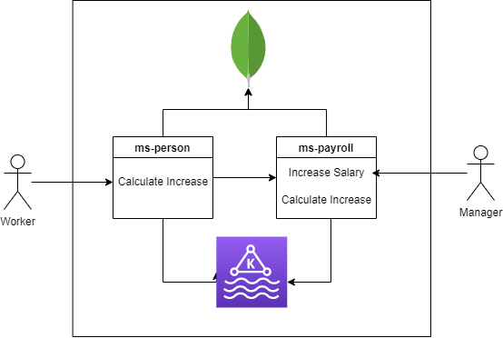
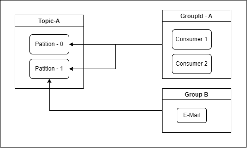

# MS-PERSON
Projeto desenvolvido para demonstração de um Kafka Produtor e Consumidor.
Foi utilizado nesse projeto idéias de comunicação assincrona e sincrona.

 - Assincrona: Kafka
 - Sincrona: OpenFeign

# Getting Started

### Instalação

Realizar o clone deste repositório e o MS-PAYROLL-POC

 - [ms-payroll-poc](https://github.com/cgeorge-cit/ms-payroll-poc)

### Docker
O arquivo de configuração "docker-compose.yml" encontra-se no repositório:

 - [ms-payroll-poc](https://github.com/cgeorge-cit/ms-payroll-poc)

Caso esteja utilizando WSL2 para subir os containers, sempre alterar o host nos seguintes arquivos:

 - docker-compose.yml
 - application.yml (Mongo e Kafka)

É aconselhado utilizar o WSL2 já que a licença do Docker Desktop será paga no futuro próximo. 

Mas caso estiver utilizando o Docker Descktop, basta configurar o host como "localhost".

 - Kafka: localhost:9092
 - Mongo: localhost:27017

Para subir os containers, basta executar o comando "docker-compose up" na raiz do projeto "ms-payroll".

 - Zookeeper
 - Kakfa
 - Mongo

### Collection Postman

 - 	[Collection Postman](./assets/TIL.postman_collection.json)

### Diagramas

## Additional Links

* [Spring for Apache Kafka](https://docs.spring.io/spring-kafka/reference/html/#kafka-template)
* [Introduction to Spring Cloud OpenFeign](https://www.baeldung.com/spring-cloud-openfeign)
* [Kotlin](https://kotlinlang.org/docs/home.html)
* [MockK: A Mocking Library for Kotlin](https://www.baeldung.com/kotlin/mockk)

* [Official Apache Maven documentation](https://maven.apache.org/guides/index.html)
* [Spring Boot Maven Plugin Reference Guide](https://docs.spring.io/spring-boot/docs/2.6.2/maven-plugin/reference/html/)
* [Create an OCI image](https://docs.spring.io/spring-boot/docs/2.6.2/maven-plugin/reference/html/#build-image)
* [Spring Boot Actuator](https://docs.spring.io/spring-boot/docs/2.6.2/reference/htmlsingle/#production-ready)
* [Spring Web](https://docs.spring.io/spring-boot/docs/2.6.2/reference/htmlsingle/#boot-features-developing-web-applications)
* [Spring Data MongoDB](https://docs.spring.io/spring-boot/docs/2.6.2/reference/htmlsingle/#boot-features-mongodb)

